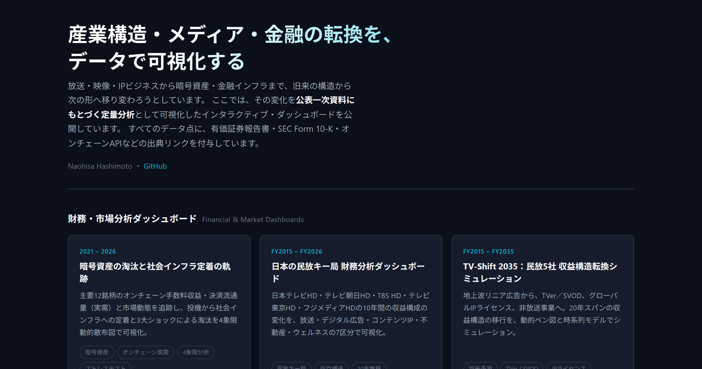

# naohisastry.github.io

メディア産業および暗号資産・金融インフラの財務・市場分析ダッシュボード集のポータルサイトです。

**公開URL: https://naohisastry.github.io/**

## 役割

1. **ハブページ** — 各ダッシュボードへの導線を1箇所に集約し、サイト間の回遊を生む
2. **robots.txt の設置場所** — GitHub Pages のプロジェクトサイト（`/<repo>/`）に置いた robots.txt はクローラに無視されます。ドメイン直下に置けるのはこのユーザーサイトのみです
3. **統合 sitemap** — 全ダッシュボードのURLを1ファイルにまとめ、Search Console に一括提出できます

## ファイル構成

| ファイル | 役割 |
|---|---|
| `index.html` | ハブページ本体（単一ファイル・依存なし・OGP対応） |
| `social-preview.png` | 1200x630 OGP/Twitter Card ソーシャルプレビューサムネイル |
| `robots.txt` | クロール許可と sitemap の所在通知 |
| `sitemap.xml` | 全8URL（ポータル + 7ダッシュボード） |

## 公開手順

1. GitHub で `naohisastry.github.io` という名前のリポジトリを **Public** で新規作成
2. 本フォルダの内容を push
3. Settings → Pages → Source を `Deploy from a branch` / `main` / `/ (root)` に設定
4. 数十秒後に https://naohisastry.github.io/ が公開されます

## 公開後にやること

- Google Search Console に `https://naohisastry.github.io/` を登録し、`sitemap.xml` を送信
- note のプロフィールおよび各記事から本ページへリンクを張る
- `index.html` 内の `TODO(Nao)` コメント2箇所に note のURLを設定

## ⚠️ 削除してはいけないファイル

`google824a75d73b7dca81.html` は Google Search Console の所有権確認ファイルです。
Google は定期的に再チェックするため、**削除すると所有権が失われ、検索パフォーマンスのデータが見られなくなります。**

- 確認方法: HTMLファイル
- 確認日: 2026-09-02
- プロパティ: https://naohisastry.github.io/ （URLプレフィックス）
- 登録アカウント: naohisastry@gmail.com

## 📄 License / ライセンス

- **Code**（HTML / CSS / JavaScript）: [MIT License](LICENSE)
- **Content**（文章・図表・分析結果・整理済みデータ）: [CC BY 4.0](LICENSE-CONTENT.md)
- 出典表示例 / Attribution: Naohisa Hashimoto, "naohisastry.github.io", https://naohisastry.github.io/
- 第三者の元データの権利は各発行元に帰属します。 / Third-party source data remain the property of their original publishers.

© 2026 Naohisa Hashimoto
